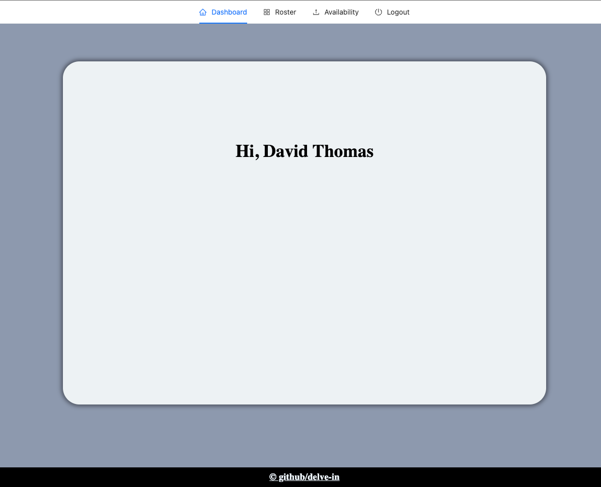
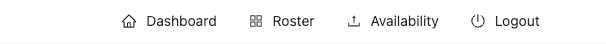
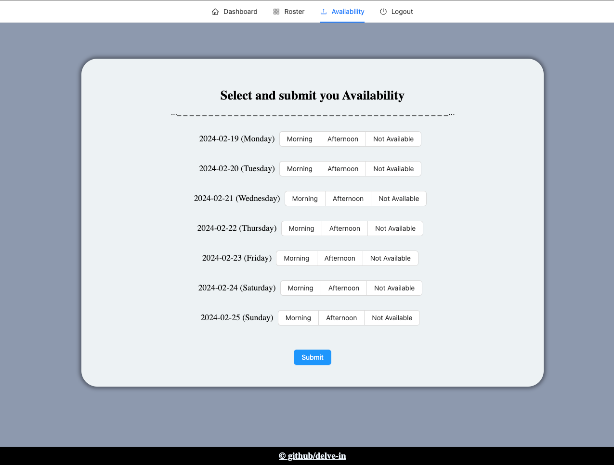
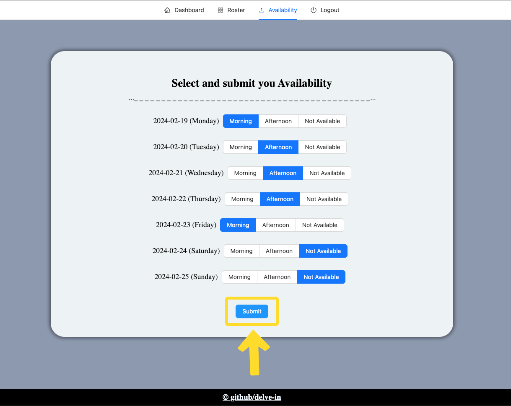
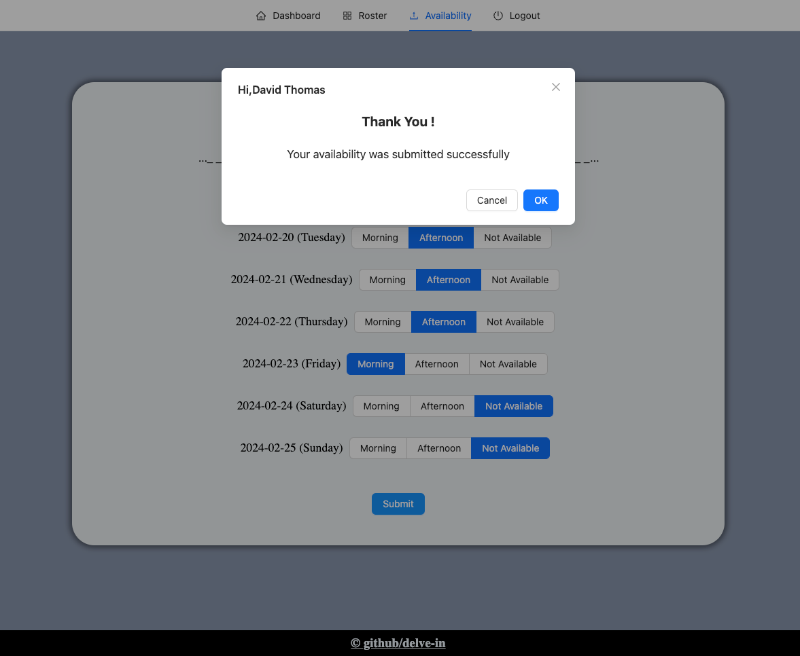
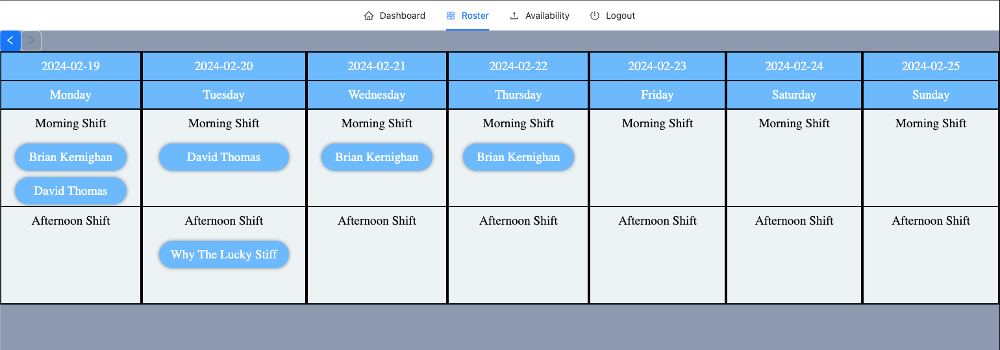
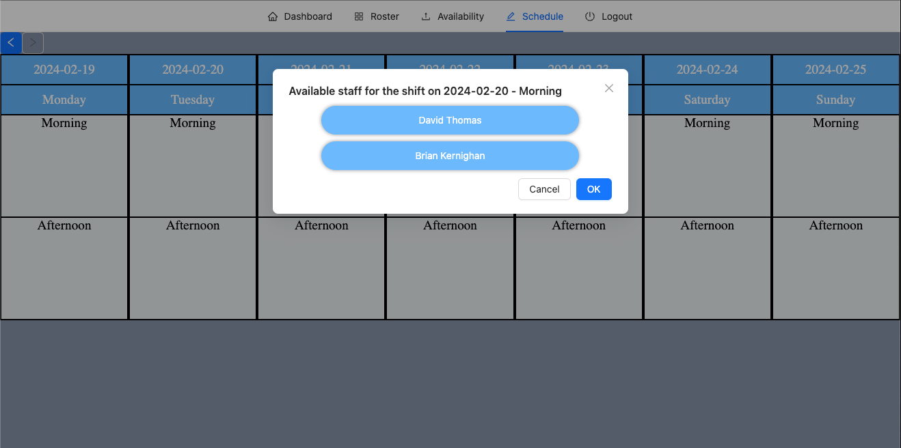

# TimeWise

Welcome to the TimeWise Website repository!. This is online free to use simple roster maker.

## Overview

TimeWise allows staff to login and sent thier shifts for the coming week, which can be seen by the manager when he/she clicks on a particular shift and schedule them accordingly. The roster for 2 weeks can be viewed by anone using the website.

## Table of Contents

* [Deployed](#Deployed)

* [Installation](#installation)

* [Usage](#usage)

* [Credits](#credits)
  
* [License](#license)

* [Contributing](#contributing)

* [Questions](#questions)

## Deployed applicatin link

[https://roster-manager-71d6219bcde1.herokuapp.com/](https://roster-manager-71d6219bcde1.herokuapp.com/)

## Installation

N/A

## Usage 

Open the link to the website 

[https://roster-manager-71d6219bcde1.herokuapp.com/](https://roster-manager-71d6219bcde1.herokuapp.com/)

When you open the link you are greeted with a login page as below. 

Please login to continue.

Once you login you will be greeted with the following page, The Dashboard. It will display your full name.

Once you have logged in if you are a staff you will see the following navigation. 

When you click on availability, you will be presented with the folowwing page.

you can select your availibility by clicking on the Morning, Afternoon or Not Available section for each day. Once you have selected your availability click the submit button.

.

If you have successfully submited you shift you will see the following message.

This means you shift was sent to the manager now you can wait for you manager to schedule you according to your availability.

You can click on Roster on the navigation bar to view the Roster page.

which will display the roster set by the manager.

For a manager the view of the website will be slightly different. Manager will have an extra Schedule page.

You can click on the Morning or Afternoon section to schedule the staff. When you click on it the following will pop up.

