# TimeWise

Welcome to the TimeWise Website repository!. This is online free to use simple roster maker.

## Overview

TimeWise allows staff to login and sent thier shifts for the coming week, which can be seen by the manager when he/she clicks on a particular shift and schedule them accordingly. The roster for 2 weeks can be viewed by anone using the website.

## Table of Contents

* [Deployed](#deployed)

* [Installation](#installation)

* [Usage](#usage)
  
* [License](#license)

* [Contributing](#contributing)

* [Questions](#questions)

## Deployed

Deployed applicatin link:

[https://roster-manager-71d6219bcde1.herokuapp.com/](https://roster-manager-71d6219bcde1.herokuapp.com/)

## Installation

N/A

## Usage 

Open the link to the website 

[https://roster-manager-71d6219bcde1.herokuapp.com/](https://roster-manager-71d6219bcde1.herokuapp.com/)

When you open the link you are greeted with a login page as below. 

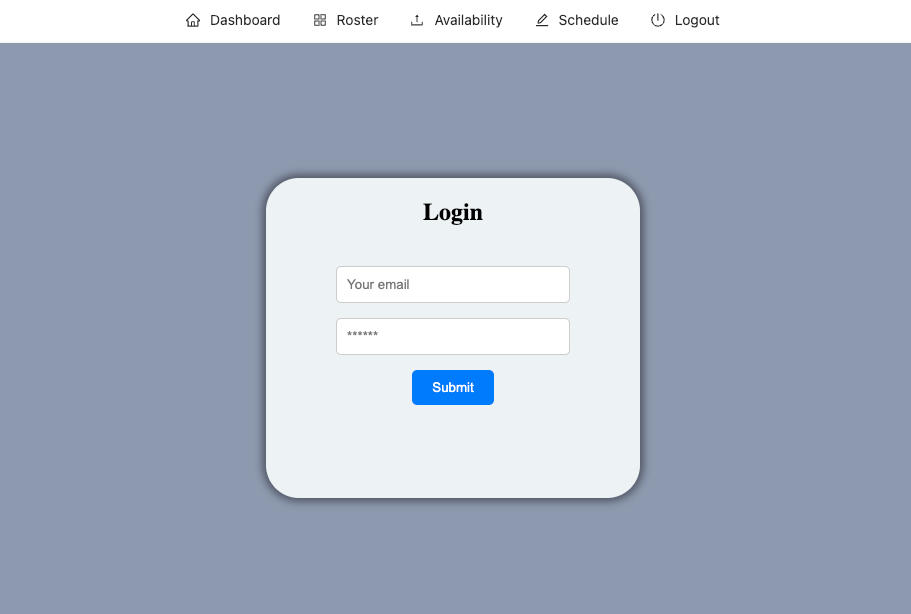

Please login to continue.

Once you login you will be greeted with the following page, The Dashboard. It will display your full name.

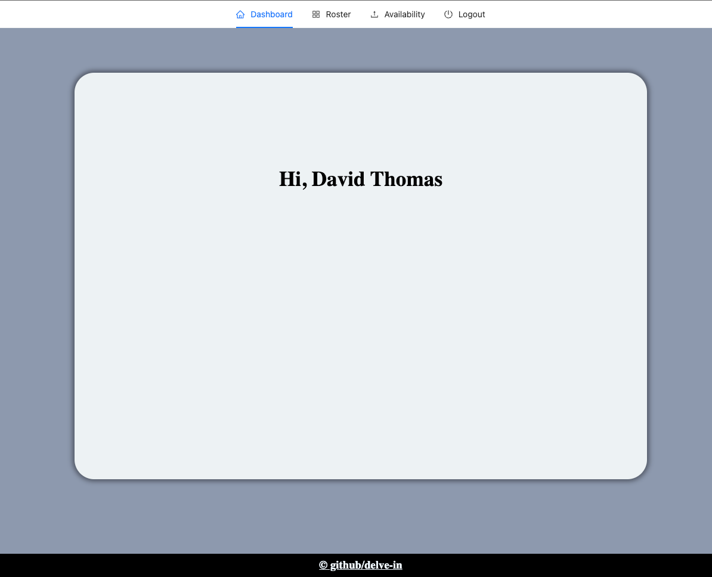

Once you have logged in if you are a staff you will see the following navigation. 

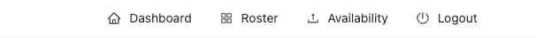

When you click on availability, you will be presented with the folowwing page.

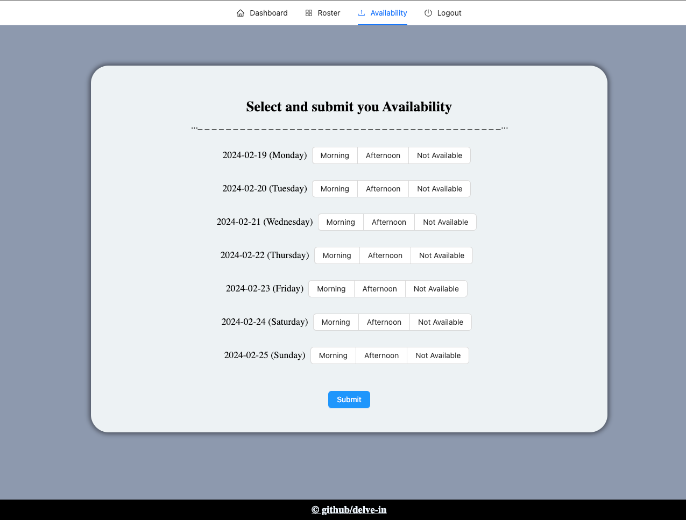

you can select your availibility by clicking on the Morning, Afternoon or Not Available section for each day. Once you have selected your availability click the submit button.

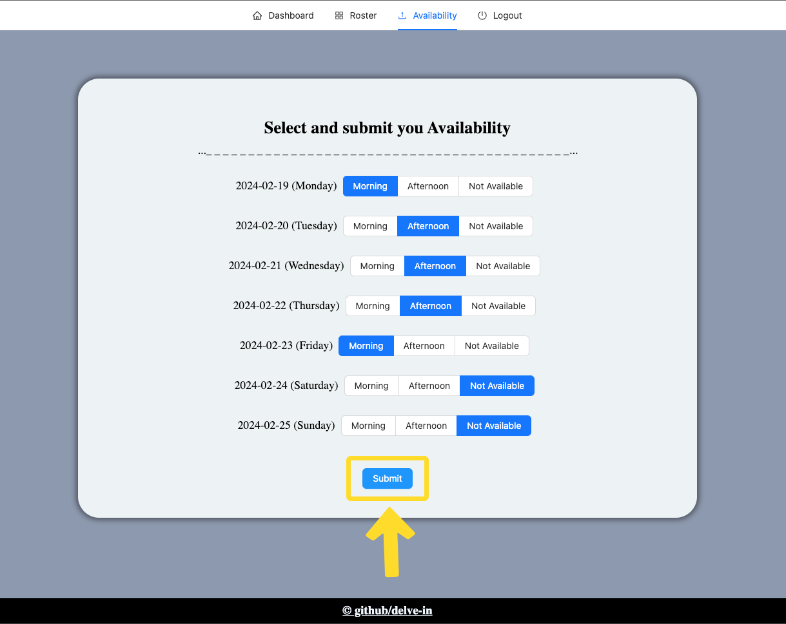

If you have successfully submited you shift you will see the following message.

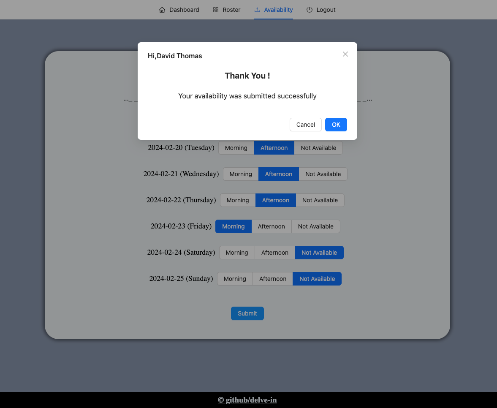

This means you shift was sent to the manager now you can wait for you manager to schedule you according to your availability.

You can click on Roster on the navigation bar to view the Roster page.

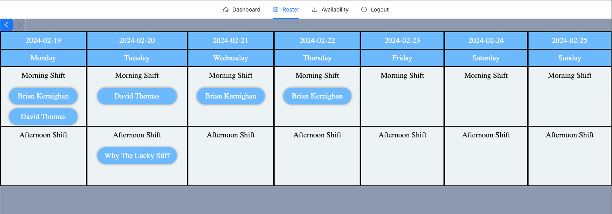

which will display the roster set by the manager.

You can click on the arrow buttons on the top left part of the page to toggle current week or next week view

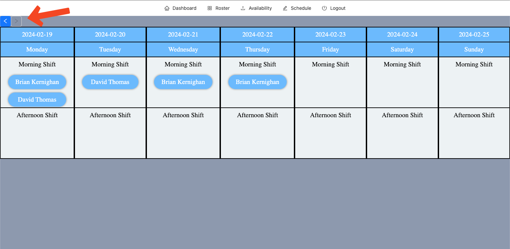

For a manager the view of the website will be slightly different. Manager will have an extra Schedule page.

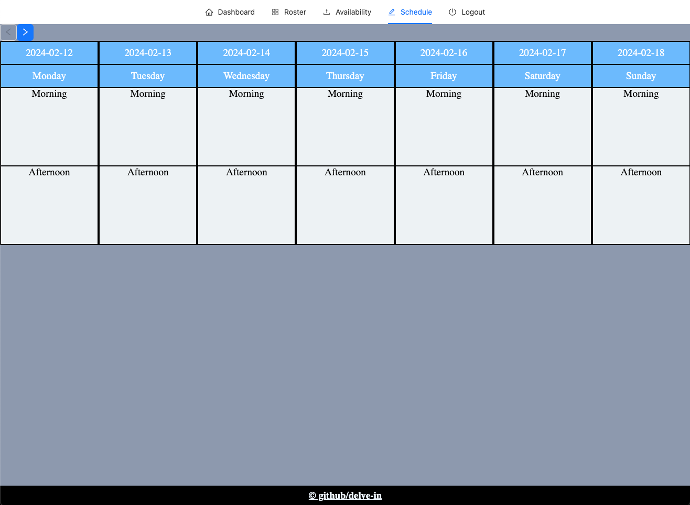

You can click on the Morning or Afternoon section to schedule the staff. When you click on it the following will pop up.

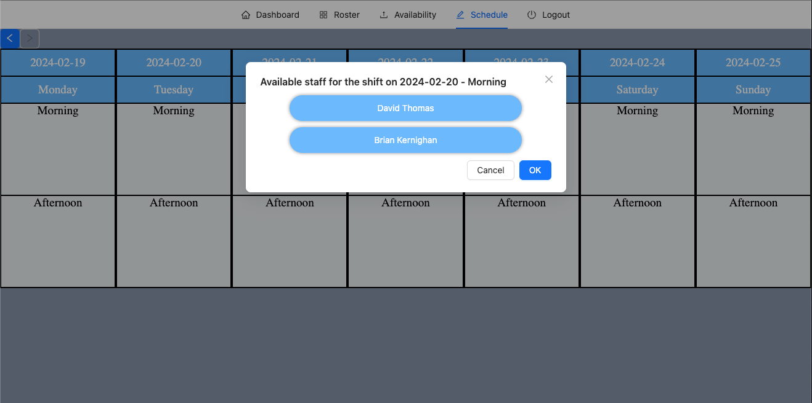

This displays the people who have sent thier availibility for that particular shift.

For example: 

In the image above, David Thomas and Brian Keringhan has given thier availibity for the morning shift on 20-02-2024.

You can select any one of them at a time (you can add multiple people for same shift but it should be done one by one).

Once select one person by cling on thier name, the following message will be shown:

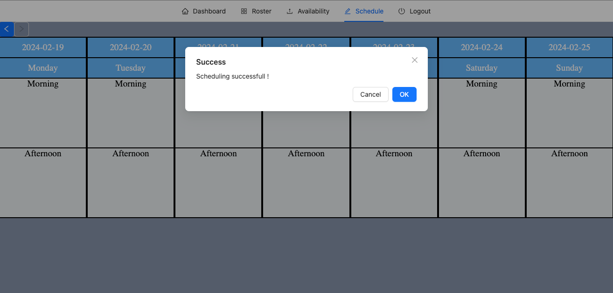

which implies you have successfully scheduled that person for that particular shift.

You can move on to the Roster page to view the roster you have created

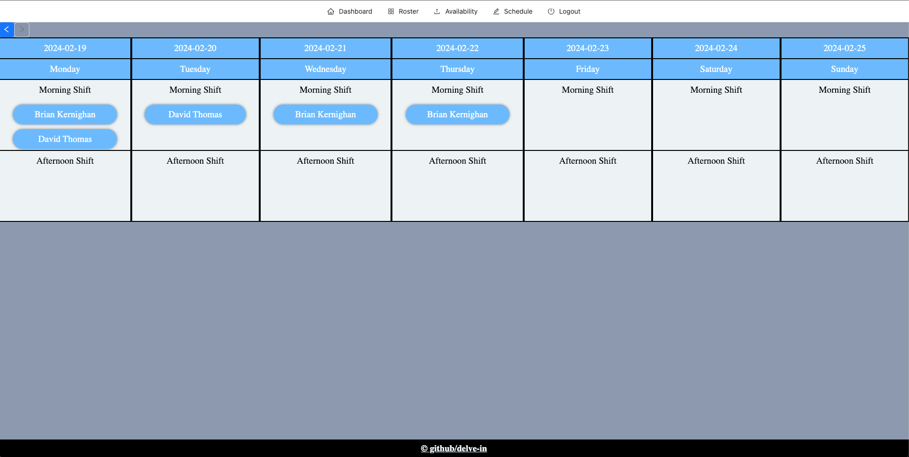

Enjoy using the app !

## License

This project is licensed under the MIT license.

## Contributing

Contributions are welcome! If you'd like to contribute to the TimeWise Website, please follow these steps:

1. Fork the repository
2. Create a new branch: `git checkout -b feature/my-feature`
3. Make your changes and commit them: `git commit -am 'Add some feature'`
4. Push to the branch: `git push origin feature/my-feature`
5. Submit a pull request

## Questions

If you have any questions about the repo, open an issue or contact me directly at write2delvin@gmail.com. You can find more of my work at [delve-in](http://github.com/delve-in/).

